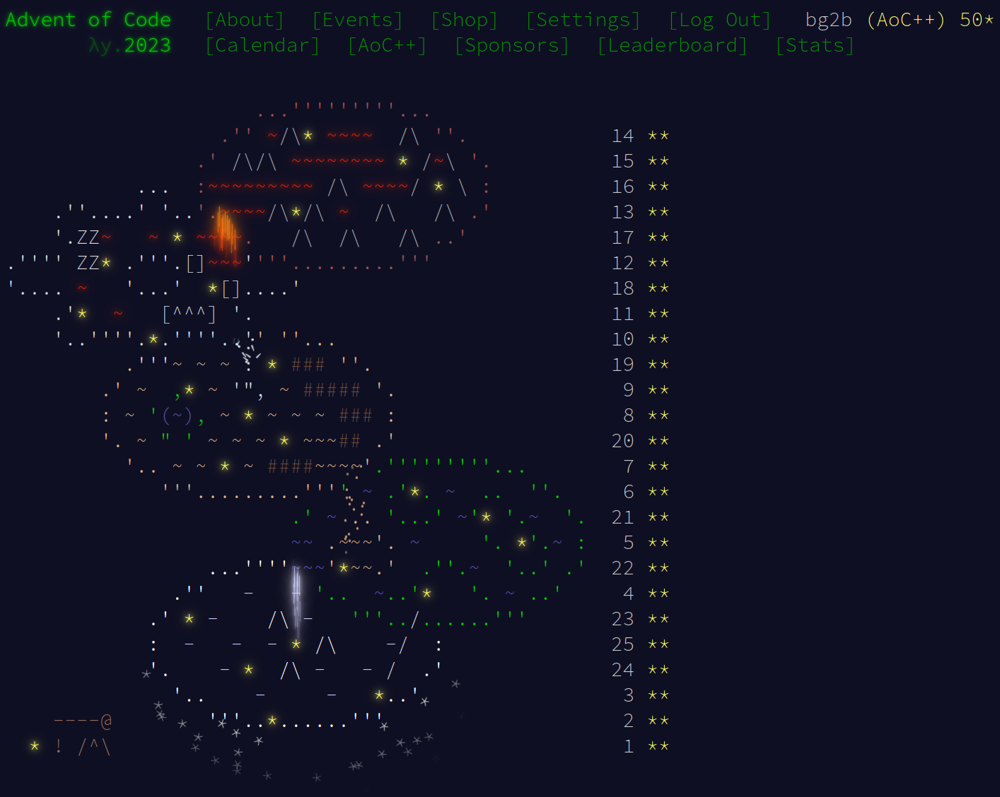

# Advent of Code 2023

Info and problems are available at https://adventofcode.com/2023

## Overview

Each day's solutions are in a subdirectory, `01`, `02`, etc.

Solutions are C++.  Compile with:
```
g++ -std=c++17 -Wall -g -o doit doit.cc
```
There are occasional problems that need something special; in that
case a comment at the start of the file will say what to do.

Example inputs, if any, are called `input1`, `input2`, etc.
The real input, as downloaded from the AOC website, would be called
`input`, though my inputs are not included in the repository.

Input is on stdin, output is printed to stdout.  Run part 1 as `./doit
1 < input` and part 2 as `./doit 2 < input`

Sometimes I might go back and revisit a problem in a different
(usually more efficient) way.  Alternatives will be other `.cc` files
starting with `doit`.

## Recommended problems

Here's my list of recommended problems for the year, along
with direct links.  Recommendations are based on a combination of
factors: perhaps the problem admits an unusual and clever solution, or
perhaps it would allow an interesting visualization, or perhaps the
problem description itself was cute.  In whatever way, I found the
problem unusually fun.  Each of these problems is either ⭐
(recommended) or ⭐⭐ (highly recommended).

+ [Day 7: Camel Cards](https://adventofcode.com/2023/day/7) ⭐
+ [Day 9: Mirage Maintenance](https://adventofcode.com/2023/day/9) ⭐
+ [Day 10: Pipe Maze](https://adventofcode.com/2023/day/10) (This one
has lots of interesting possible approaches for part 2) ⭐⭐
+ [Day 12: Hot Springs](https://adventofcode.com/2023/day/12) ⭐⭐
+ [Day 14: Parabolic Reflector Dish](https://adventofcode.com/2023/day/14) ⭐⭐
if you enjoy seeing how fast you can roll, ⭐ otherwise
+ [Day 16: The Floor Will Be Lava](https://adventofcode.com/2023/day/16)
⭐ if you do it in a straightforward manner, ⭐⭐ if you want to try to be
clever
+ [Day 17: Clumsy Crucible](https://adventofcode.com/2023/day/17) ⭐⭐
+ [Day 18: Lavaduct Lagoon](https://adventofcode.com/2023/day/18) ⭐
+ [Day 20: Pulse Propagation](https://adventofcode.com/2023/day/20) ⭐⭐
+ [Day 21: Step Counter](https://adventofcode.com/2023/day/21) Sneaky,
very sneaky... ⭐⭐
+ [Day 24: Never Tell Me The Odds](https://adventofcode.com/2023/day/24) ⭐

## Other years

These are my AoC repositories for previous years (all C++, mostly the
same format as this year).  Years that I though were the most fun are
marked with ⭐ or ⭐⭐

+ [2022](https://github.com/bg2b/aoc22) ⭐⭐
+ [2021](https://github.com/bg2b/aoc21) ⭐ You always remember your
first... \
(This was the first year I participated live, and I did the solutions
as two separate parts)
+ [2020](https://github.com/bg2b/aoc20)
+ [2019](https://github.com/bg2b/aoc19) Intcode FTW ⭐⭐
+ [2018](https://github.com/bg2b/aoc18) ⭐⭐
+ [2017](https://github.com/bg2b/aoc17) ⭐ for the advent calendar
animation alone
+ [2016](https://github.com/bg2b/aoc16) ⭐
+ [2015](https://github.com/bg2b/aoc15)


